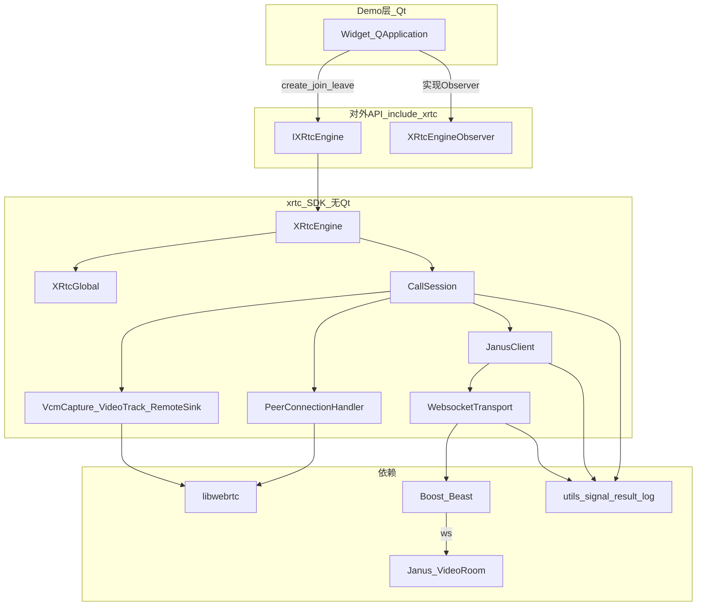
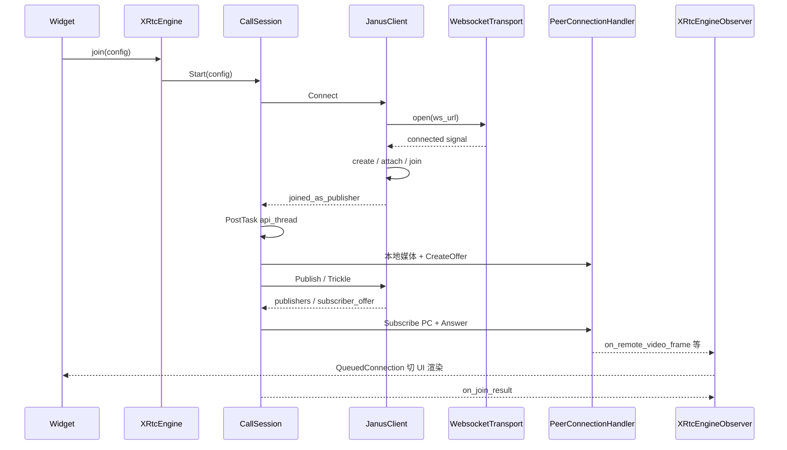
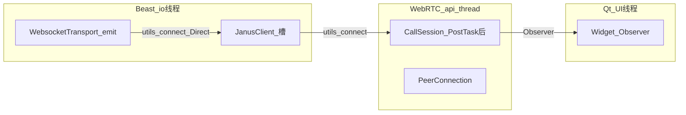

# xrtc 项目结构

本仓库是「无 Qt 的实时音视频 SDK（`xrtc`）+ Qt Demo」。  
在 Cursor / VS Code 中打开本文件，用 Markdown 预览即可查看下方 Mermaid 图。

---

## 1. 整体分层



---

## 2. 目录对应关系

| 路径 | 角色 |
|------|------|
| `include/xrtc/` | 对外契约：引擎接口、Observer、数据结构、log/result |
| `include/engine/` | 引擎实现与全局单例 |
| `include/session/` | 通话编排（CallSession） |
| `include/janus/` | Janus 信令客户端 + WebSocket 传输 |
| `include/pc/` | PeerConnection 封装 |
| `include/media/` | 采集 / 视频源 / 远端渲染 sink |
| `src/**` | 与 `include/<module>` 一一对应的实现 |
| `demo/` | Qt UI，实现 `XRtcEngineObserver` |
| `utils/` | 自研框架：信号槽 / expected / log |
| `third_party/` | nlohmann/json、spdlog（Demo 日志后端） |

---

## 3. 一次 join 的主链路



---

## 4. 模块职责（心智图）

```text
        ┌──────────── Demo (Qt) ────────────┐
        │  Widget = Observer + 调 Engine     │
        └───────────────┬───────────────────┘
                        │ IXRtcEngine / Observer
        ┌───────────────▼───────────────────┐
        │           XRtcEngine               │
        │              │                     │
        │         CallSession  ◄── 编排核心   │
        │          /        \                │
        │     JanusClient   PeerConnection   │
        │         │         + 本地/远端媒体   │
        │   WebsocketTransport               │
        └─────────┼─────────────┬────────────┘
                  │             │
              Janus 信令      libwebrtc 媒体
```

| 模块 | 一句话 |
|------|--------|
| **XRtcGlobal** | 单例：WebRTC 三线程、PC Factory、全局 Observer |
| **XRtcEngine** | `IXRtcEngine` 实现：设备、预览源、持有 CallSession |
| **CallSession** | 通话编排：Janus 事件 ↔ PC/采集 ↔ Observer |
| **JanusClient** | VideoRoom 协议状态机 |
| **WebsocketTransport** | Boost.Beast WebSocket（Pimpl） |
| **PeerConnectionHandler** | 单个 PeerConnection（SDP/ICE/Track） |
| **VcmCapture / VideoTrackSource** | 本地摄像头 → 视频轨 |
| **RemoteVideoSink** | 远端轨 → ARGB → Observer |

---

## 5. 事件与线程



| 线程 | 典型工作 |
|------|----------|
| Qt UI | Widget、Demo 里 Queued 回来的 Observer |
| WebRTC api_thread | 建 PC、改 SDP、多数 CallSession 业务 |
| WebRTC worker/network | 编解码、ICE、收发包 |
| Beast io | WebSocket 读写、Janus JSON 解析入口 |
| 采集线程 | VCM 出帧 |

原则：**谁产生事件就在谁的线程 emit；碰 WebRTC 就 PostTask 到 api_thread；碰 UI 就投到 Qt。**

---

## 6. 建议阅读顺序

1. `include/xrtc/ixrtc_engine.h`、`xrtc_defines.h`
2. `demo/widget.cpp`（`join_meeting` / `on_join_result`）
3. `src/session/call_session.cpp`（`Start` + `bindJanusSignals`）
4. `src/janus/janus_client.cpp`
5. `src/janus/websocket_transport.cpp`
6. `src/pc/peer_connection.cpp`

---

## 7. 预览说明

### Mermaid（本文件）

- **Cursor / VS Code**：`Ctrl+Shift+V` 打开预览；若仍显示代码块，需安装 **Markdown Preview Mermaid Support**
- **在线**：[https://mermaid.live](https://mermaid.live)

### PlantUML（推荐，预览更稳）

- **完整类图（一张）**：[plantuml/05-class-diagram.puml](./plantuml/05-class-diagram.puml)（说明见 [class-diagram.md](./class-diagram.md)）
- 其它图：[architecture-plantuml.md](./architecture-plantuml.md)、[plantuml/](./plantuml/)（安装 **PlantUML** 扩展后 `Alt+D` 预览）
